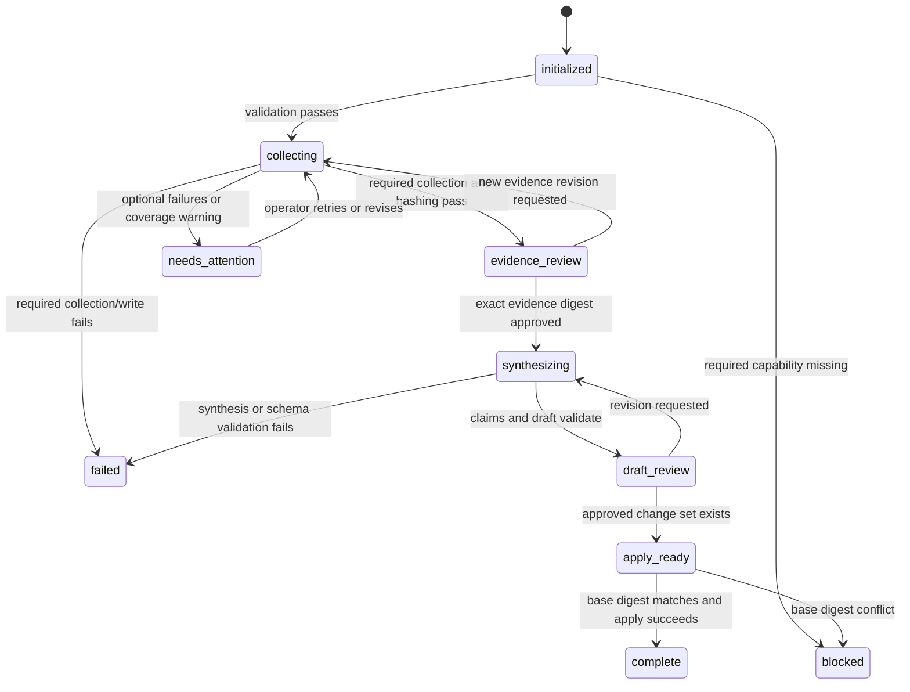
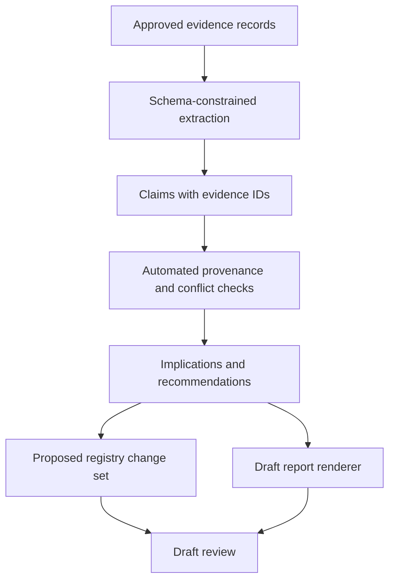

# Competitive Intelligence for Codex — Implementation Blueprint

This is a proposed design, not an implementation authorization.

---

## 1. Purpose

This blueprint translates the product requirements into a portable implementation that can
be developed privately, validated with synthetic data and public Polygon golden examples,
and released as a reusable Codex plugin. It deliberately separates deterministic workflow
control from agent judgment and separates installed code from adopter-owned competitive
data.

The corresponding product requirements are in
`DOC-comp-intel-codex-migration-prd-v1.0.md`. Acceptance is defined in
`DOC-comp-intel-public-acceptance-tests-v1.0.md`.

Implementation is split across `DOC-comp-intel-codex-skill-implementation-prd-v1.0.md`,
`DOC-comp-intel-integrations-implementation-prd-v1.0.md`,
`DOC-comp-intel-private-migration-prd-v1.0.md`, and
`DOC-comp-intel-public-distribution-prd-v1.0.md`.

## 2. Architecture Principles

1. **The repository is canonical; the plugin is an install wrapper.** Skill, controller,
   schemas, examples, tests, and PRDs are developed in one public repository. Config,
   evidence, approvals, registries, and reports never live in the installed distribution.
2. **The skill routes; the controller governs.** Prompt instructions do not enforce stage
   transitions, hashes, permissions, or path safety.
3. **Collection and synthesis are separate executions.** Synthesis uses an approved digest
   and cannot call live sources.
4. **Connectors are adapters, not workflow branches.** Source-specific behavior is behind a
   common interface and a capability manifest.
5. **Structured state is canonical.** Markdown is a rendered interface for humans.
6. **Every meaningful conclusion is traceable.** Claims refer to immutable evidence IDs;
   changes refer to claims and base-state digests.
7. **Desktop is the v1 product surface.** Domain operations remain independent of the UI so
   a later headless adapter does not require a data or workflow redesign.
8. **Unattended execution is a future, less-privileged adapter.** When implemented, it may
   collect and stage, never approve, synthesize, mutate canonical state, or publish.
9. **Golden examples are public Polygon cases.** Each one uses publicly supportable evidence
   and explicit publication review; synthetic fixtures remain the deterministic test layer.
10. **Private fixtures stay private.** Internal names, channels, systems, profiles, deal
    context, and intelligence stay outside the public repository and its Git history.
11. **Failure is explicit.** Partial success is not completion, and degraded coverage is
   visible in state and reports.
12. **Portability is tested, not asserted.** Clean install, update, uninstall, and second-
    computer scenarios are release gates.
13. **Build-time and runtime guidance are separate.** Root `AGENTS.md` makes Codex consult
    the PRD suite while building this product; the runtime skill activates only for
    competitive-intelligence work.

### 2.1 Desktop-first boundary

The Codex Desktop skill owns conversation, clarification, user-visible progress, connection
setup, review presentation, and safe handoff between stages. The controller owns domain
state, validation, collection requests, evidence normalization, hashes, and change
application. No canonical state may depend on a Desktop conversation ID or UI-only object.

Version 1 may expose a bundled command surface for the skill to call, but direct headless use
is experimental and unsupported. A later headless adapter must consume the same config,
adapter, run, evidence, approval, claim, and change-set contracts.

## 3. Proposed Canonical Repository and Plugin Wrapper

```text
competitive-intelligence/
├── AGENTS.md
├── .codex-plugin/
│   └── plugin.json
├── .agents/
│   └── plugins/
│       └── marketplace.json        # optional local/public catalog
├── skills/
│   └── comp-intel/
│       ├── SKILL.md
│       ├── agents/
│       │   └── openai.yaml
│       ├── references/
│       │   ├── RUN-workflow.md
│       │   ├── DOC-configuration.md
│       │   ├── DOC-source-policy.md
│       │   ├── DOC-evidence-and-claims.md
│       │   ├── DOC-review-and-apply.md
│       │   └── DOC-troubleshooting.md
│       └── assets/
│           ├── config.example.yaml
│           ├── report-template.md
│           └── market-pack.example.yaml
├── scripts/
│   ├── comp_intel.py
│   └── comp_intel/
│       ├── __init__.py
│       ├── cli.py
│       ├── config.py
│       ├── paths.py
│       ├── capabilities.py
│       ├── controller.py
│       ├── state_machine.py
│       ├── approvals.py
│       ├── hashing.py
│       ├── normalize.py
│       ├── deduplicate.py
│       ├── claims.py
│       ├── changes.py
│       ├── apply.py
│       ├── render.py
│       └── adapters/
│           ├── base.py
│           ├── synthetic.py
│           ├── local_files.py
│           ├── web.py
│           ├── github.py
│           └── slack.py            # optional integration
├── schemas/
│   ├── config.schema.json
│   ├── market-pack.schema.json
│   ├── evidence.schema.json
│   ├── claim.schema.json
│   ├── run.schema.json
│   ├── approval.schema.json
│   ├── competitor.schema.json
│   └── change-set.schema.json
├── examples/
│   ├── polygon-golden/
│   │   ├── chain/
│   │   ├── payments/
│   │   └── wallets/
│   └── synthetic-devtools/
│       ├── config.yaml
│       ├── market-pack.yaml
│       ├── sources/
│       └── expected/
├── tests/
│   ├── unit/
│   ├── contract/
│   ├── integration/
│   ├── security/
│   └── portability/
├── docs/
│   ├── product-requirements/
│   ├── installation.md
│   ├── quickstart.md
│   ├── data-and-privacy.md
│   ├── connector-setup.md
│   ├── upgrade.md
│   └── uninstall.md
├── LICENSE
└── NOTICE
```

The source repository is usable by contributors without treating the plugin manifest as the
architecture. Root `AGENTS.md` must direct Codex to the master PRD and the relevant
implementation PRD for any task that builds, changes, tests, or distributes this skill. This
is what makes the specifications persistent during skill building.

The thin plugin wrapper exists because official Codex packaging can distribute skills and
connector/MCP mappings together behind a stable install identity. Users who only need the
standalone skill may use the documented skill path; users who want the supported integrated
experience install the plugin wrapper. There is no separate starter repository in v1.

Polygon golden packs are implemented in order: Chain, Payments, then Wallets. Each pack has
its own source manifest, expected outputs, and public-release approval.

If the public toolkit remains the distribution repository, this tree may be rooted at the
repository root or under a plugin directory according to its marketplace convention. The
skill's references must remain resolvable from the installed artifact. A standalone skill
copy may not depend silently on repository-root documents.

## 4. Adopter Data Layout

Default repository-local layout:

```text
.comp-intel/
├── config.yaml
├── markets/
│   └── synthetic-devtools.yaml
├── state/
│   ├── competitors/
│   ├── trackers/
│   └── migrations/
├── runs/
│   └── <run-id>/
│       ├── run.yaml
│       ├── capabilities.json
│       ├── collection/
│       │   ├── raw/
│       │   ├── evidence.jsonl
│       │   ├── evidence-manifest.json
│       │   └── coverage.json
│       ├── approvals/
│       ├── synthesis/
│       │   ├── claims.jsonl
│       │   ├── proposed-change-set.yaml
│       │   └── report-draft.md
│       ├── reviews/
│       └── audit.jsonl
└── outputs/
    ├── reports/
    ├── snapshots/
    ├── battlecards/
    └── rendered-state/
```

The data root is resolved in this order:

1. explicit `--data-root` argument;
2. `data_root` in a project-owned config outside the plugin;
3. discovered repository-local `.comp-intel/`;
4. an explicitly initialized user-local location.

There is no implicit write to the plugin cache, home directory, or current directory. The
resolved path is printed before the first mutating command and validated against path
traversal and symlink escape.

### 4.1 Adopter mapping manifest

Initialization creates an unpopulated mapping manifest that requires the adopter to map:

- public and internal organization/product names;
- market and competitor aliases;
- Slack workspaces, channels, users, and query terms;
- GitHub organizations and repositories;
- company document systems and allowed roots;
- current registries, historical reports, evidence, trackers, and retention rules;
- stakeholder lenses and their privacy classification;
- output owners, reviewers, approvers, and destinations;
- connector permissions and required/optional status.

The Polygon golden pack illustrates field shape and expected outputs. It is never silently
copied as the adopter's live configuration. Unmapped organization fields remain visibly
incomplete and block only the stages that require them.

## 5. Component Responsibilities

### 5.1 `SKILL.md`

The skill is a concise, imperative router. It should contain:

- trigger language;
- which bundled command to use for init, collect, status, synthesize, propose, apply, and
  render;
- the absolute rule that collection stops at evidence review;
- when to read each reference;
- the fact that source content is untrusted data;
- how to surface a missing capability;
- the clarification rules for market, window, and operation.

It should not contain current competitor facts, long source lists, connector IDs, mutable
registries, implementation details, or an entire runbook. Valid frontmatter should contain
only supported Codex skill fields. Version belongs in plugin or package metadata rather than
an unsupported skill-frontmatter key.

### 5.2 `agents/openai.yaml`

The agent metadata should provide:

- display name, concise description, and example invocation;
- whether implicit invocation is allowed;
- required local executable/runtime dependencies;
- optional connector dependencies for adapter-specific features;
- icons or branding only when license and public-release review permit them.

Do not declare Slack or GitHub required for the base product. A market pack that marks one
required should cause runtime preflight to block if it is absent.

### 5.3 Controller

The controller is the only component allowed to transition run stages. It:

- loads and validates config;
- resolves absolute dates and paths;
- creates run IDs and initial state;
- discovers adapter capabilities;
- invokes adapters;
- normalizes and deduplicates evidence;
- writes manifests and hashes;
- checks approvals;
- invokes bounded synthesis where needed;
- validates claims and change sets;
- applies approved changes transactionally;
- renders human views;
- writes append-only audit events.

The controller should be usable as a Python library and a CLI. If a different implementation
language is chosen, the same boundary and testability requirements apply.

### 5.4 Agent synthesis boundary

Agent reasoning is appropriate for:

- classifying ambiguous evidence with an explicit confidence label;
- drafting claims from approved evidence;
- identifying implications and positioning gaps;
- writing report narrative;
- proposing, but not applying, canonical changes.

The synthesis request receives:

- the approved evidence manifest and evidence records;
- current structured competitor state and its digest;
- market-pack analysis rules;
- output JSON Schema;
- a prohibition on tools and live retrieval;
- an instruction to return missing/uncertain rather than fabricate.

Raw prose is not written directly to canonical state. The returned structured model is
validated, and the report is rendered from it.

### 5.5 Adapters

Each adapter implements an interface conceptually equivalent to:

```python
class SourceAdapter(Protocol):
    adapter_id: str
    version: str

    def probe(self, source_config) -> CapabilityResult: ...
    def collect(self, request: CollectionRequest) -> Iterable[RawCandidate]: ...
    def checkpoint(self) -> AdapterCheckpoint: ...
```

Adapters may read sources and return candidates. They may not approve runs, synthesize
claims, write canonical state, or invoke publishers.

#### Synthetic adapter

Reads deterministic fixture files and is always available. It is the reference implementation
for pagination, edited records, duplicate records, conflicts, and failure injection.

#### Local-files adapter

Reads configured files under explicit allowed roots. It rejects path escape, unsupported
formats, and files that exceed configured size limits. It records content hashes.

#### Web adapter

Uses the host's supported web research capability. It separates search discovery from page
retrieval, records canonical URLs, validates observed/published dates, honors domain policy,
and downgrades snippets or inaccessible pages.

#### Slack adapter

Uses a user-installed Codex connector or neutral MCP contract. It must support stable message
IDs, pagination, thread expansion, message edit timestamps, deletion behavior, rate-limit
checkpointing, and private-data labels. It must never embed workspace, channel, or user IDs
in the public package.

#### GitHub adapter

Uses a supported connector, MCP server, or read-only CLI path selected by the adopter. It
normalizes repository, release, issue, pull request, commit, and publication timestamps. A
source policy decides whether forks, comments, or third-party repositories are authoritative.

## 6. Command Surface

Proposed stable CLI:

```text
comp-intel init [--data-root PATH] [--example synthetic-devtools]
comp-intel doctor [--market ID] [--json]
comp-intel collect --market ID (--from DATE --to DATE | --baseline DAYS)
comp-intel status [--run-id ID] [--json]
comp-intel review-package --run-id ID
comp-intel approve-evidence --run-id ID --approval-file PATH
comp-intel synthesize --run-id ID
comp-intel review-draft --run-id ID
comp-intel propose-apply --run-id ID
comp-intel approve-apply --run-id ID --approval-file PATH
comp-intel apply --run-id ID
comp-intel render [--market ID | --run-id ID]
comp-intel migrate legacy-markdown --source-root PATH --market ID --dry-run
comp-intel validate [--run-id ID | --market ID | --all]
```

The exact binary entry point may be a bundled script, but user-facing verbs and stage
semantics should remain stable. The Desktop skill is the supported v1 caller. Commands return
non-zero on a blocking condition and should produce structured results so a later headless
adapter can be added without changing the workflow contract.

### 6.1 Interactive skill mapping

| User intent | Skill action |
|---|---|
| “Run comp intel for Market A” | Resolve dates, show capability summary, invoke `collect`, stop at review |
| “Continue the reviewed run” | Require/display run ID, validate digest and approval, invoke `synthesize` |
| “What needs review?” | Invoke `status`, summarize runs at review stages without mutation |
| “Apply the approved updates” | Validate apply approval and base digest, invoke `apply` |
| “Set up weekly collection” | Explain that headless scheduling is deferred from v1; retain the requested cadence as setup input only if the user asks |
| “Publish the report” | Explain that publication is outside the plugin; do not invoke an external publisher |

## 7. State Machine



`needs_attention` is not approval-ready until policy says coverage is sufficient and the run
is explicitly transitioned to `evidence_review`. `blocked` and `failed` are terminal for a
specific run revision; recovery creates a recorded retry or revision rather than rewriting
history.

### 7.1 Transition guard

Every mutating command performs, in order:

1. load run state;
2. validate schema;
3. validate current stage allows the command;
4. validate all input artifact hashes;
5. validate applicable approval and digest;
6. validate path and lock ownership;
7. write artifacts to a temporary run-local location;
8. validate new artifacts;
9. atomically replace or append declared targets;
10. append transition audit event;
11. persist new state atomically.

## 8. Run and Approval Records

### 8.1 Run record minimum fields

```yaml
schema_version: 2
run_id: run_01JEXAMPLE
market_id: synthetic-devtools
market_pack_version: 1.0.0
plugin_version: 1.0.0
controller_version: 1.0.0
runtime:
  host: codex
  mode: interactive
  model: null
window:
  from: 2026-08-18
  to: 2026-08-25
stage: evidence_review
capabilities:
  manifest: capabilities.json
artifacts:
  evidence_manifest:
    path: collection/evidence-manifest.json
    sha256: example
transitions:
  - from: collecting
    to: evidence_review
    at: 2026-08-25T18:00:00Z
warnings: []
errors: []
```

### 8.2 Approval record minimum fields

```yaml
schema_version: 1
approval_id: apr_01JEXAMPLE
run_id: run_01JEXAMPLE
stage: evidence_review
decision: approved
artifact:
  role: evidence_manifest
  path: collection/evidence-manifest.json
  sha256: example
approver:
  id: configured-reviewer-id
  role: evidence_reviewer
decided_at: 2026-08-25T19:00:00Z
comment: Evidence coverage accepted for synthesis.
```

The implementation may use the repository's existing run-control format privately. The
public package must document its approval-system boundary and provide a local file-based
reference adapter without implying that conversational approval is sufficient.

## 9. Evidence and Deduplication Design

### 9.1 Canonical identity

Evidence identity should use the strongest source-native stable identifier available:

- Slack workspace/message stable ID plus edit timestamp;
- GitHub repository plus object type and object ID/SHA;
- web canonical URL plus stable publication/version identifier or content hash;
- local relative path under allowed root plus content hash.

The evidence ID must not include a secret or raw private excerpt.

### 9.2 Exact and near duplicates

1. Exact native ID and same source version: one record, repeated observation appended to
   collection metadata.
2. Same canonical URL/object with changed content: new revision linked by `supersedes`.
3. Different sources reporting the same event: separate evidence records linked as
   corroboration.
4. Semantically similar text: candidate near-duplicate with algorithm/version/score; never
   auto-delete solely on model judgment.

The first implementation should prefer deterministic token normalization and a documented
similarity metric. Model-assisted clustering may be additive but must not erase evidence.

## 10. Claim and Report Pipeline



Automated checks should flag:

- claim without evidence;
- evidence classified `missing` or `rejected` used as support;
- high-confidence claim supported only by weak source types;
- changed competitor fact without a change-set operation;
- narrative-change claim without a prior/current evidence pair;
- recommendation phrased as a sourced observation;
- report statement not represented in the claims model.

Some prose-to-claim coverage checks will remain heuristic. Their output is a review warning,
not permission to publish.

## 11. Canonical Competitor State

Recommended conceptual structure:

```yaml
schema_version: 1
market_id: synthetic-devtools
competitor_id: northstar
display_name: Northstar
status: active
official_sources:
  product: https://example.invalid/product
  docs: https://example.invalid/docs
capabilities:
  audit_log_export:
    value: documented
    effective_at: 2026-08-20
    claim_ids: [cl_01JEXAMPLE]
narrative:
  current:
    text: Synthetic example positioning.
    claim_ids: [cl_01JEXAMPLE2]
history:
  - change_set_id: cs_01JEXAMPLE
updated_at: 2026-08-25T20:00:00Z
```

Configuration, evidence, analytical claims, and canonical competitor state are distinct:

- config says what to monitor;
- evidence records what sources contain;
- claims express supported interpretations;
- competitor state holds accepted current knowledge;
- rendered reports communicate selected views.

This replaces the legacy pattern where a large Markdown table serves all five purposes.

## 12. Concurrency and Atomicity

- A run directory is immutable except for append-only audit records and controlled stage
  additions.
- Canonical market state uses an exclusive lock for apply and an expected base digest.
- Shared trackers should prefer append-only event files followed by deterministic rendering.
- Temporary writes occur inside the target filesystem and are atomically renamed after
  validation.
- Same-day and same-market reruns never share a run directory.
- A stale lock must include process/host/time metadata and require an explicit recovery
  command; it must not be silently broken.
- Multi-computer sync conflicts are detected by base digest and resolved by a new proposed
  change set.

## 13. Error Model and Exit Codes

Suggested stable categories:

| Code | Category | Meaning |
|---:|---|---|
| 0 | success | Requested operation completed and state is valid |
| 2 | usage/config | Invalid command or configuration |
| 3 | capability | Required adapter or permission unavailable |
| 4 | collection | Required source collection failed |
| 5 | validation | Schema, hash, or policy validation failed |
| 6 | approval | Missing, rejected, stale, or unauthorized approval |
| 7 | conflict | Base state changed or lock conflict occurred |
| 8 | synthesis | Agent or structured-output step failed |
| 9 | write | Artifact or state write failed |
| 10 | privacy | Output violates configured sensitivity or public-release policy |

Machine output should include `status`, `code`, `message`, `run_id`, `stage`, `warnings`, and
`next_actions`. Human output may be concise but must not conceal the category.

## 14. Claude-to-Codex Mapping

| Legacy concept | Codex target |
|---|---|
| `claude -p <trigger>` | Interactive skill invocation or explicit `codex exec` instruction around the controller |
| `--allowedTools` | Plugin/skill dependency metadata plus runtime capability probe |
| Claude tool names | Adapter-neutral operations |
| `.claude/settings.json` | Not migrated as product config; users connect supported tools separately |
| Hard-coded MCP IDs | Named optional connector capabilities |
| Mode-specific registry references inside skill | External versioned market packs |
| Markdown signals file | Normalized evidence JSONL plus rendered Markdown view |
| Date/mode bead | Collision-resistant run record with transitions and hashes |
| “latest signals” resume | Explicit run ID and exact digest validation |
| Direct registry mutation | Proposed change set followed by separately approved apply |
| Report-file existence as success | Required artifacts + capabilities + schemas + stage validation |
| Baseline special case | Same state machine with a different window policy |
| Agent ID `claude` | Runtime identity and version metadata |

Codex's import-from-another-agent feature may help copy a skill or settings as a starting
point, but it is not the migration mechanism for this product. Imported permissions, hooks,
and connector configuration require review and cannot replace the controller or data model.

## 15. Private Migration Work Plan

### 15.1 Inventory and freeze

- Record the legacy skill, runbook, registries, wrapper, checker, run state, output types,
  schedulers, and downstream consumers by commit.
- Mark legacy mutable sources read-only during conversion windows.
- Repair false-positive checks before using them as parity evidence.

### 15.2 One-time converters

Implement dry-run-first converters for:

- market configuration and competitor rosters;
- current facts/capabilities from registries;
- narrative snapshots;
- historical signals and reports into provenance-linked archive records where feasible;
- run beads into read-only legacy run references;
- shared trackers into structured events.

Every converter writes:

- source file/hash;
- parsed records;
- skipped/ambiguous rows;
- target preview;
- validation results;
- a human-readable diff.

No legacy source is deleted by the converter.

### 15.3 Compatibility renderers

Render the legacy Markdown shapes from structured state during migration if downstream
private skills still consume them. Mark them generated and prohibit manual edits. Update
downstream consumers one by one, then remove compatibility rendering in a later breaking
release.

### 15.4 Canary comparison

For each private market:

1. resolve one absolute date window;
2. run legacy and Codex collection with equivalent enabled sources;
3. freeze both evidence sets;
4. compare unique relevant signals, missed authoritative sources, duplicates, date errors,
   and collection failures;
5. synthesize independently;
6. review unsupported claims, implication coverage, and proposed state diffs;
7. record discrepancies by root cause: source, adapter, contract, model, policy, or reviewer;
8. fix the reusable layer before tuning market-specific prompts.

Recommendation: require three consecutive reviewed passing windows for each market before
cutover.

## 16. Public Release Assembly

### 16.1 Publication source

Assemble the public repository and plugin wrapper from an explicit allowlist of code,
schemas, templates, approved
Polygon golden examples, and synthetic fixtures. Do not copy the private skill directory
wholesale and then attempt to remove sensitive content. Each Polygon source and derived
claim must appear in a public-source manifest with its review status and artifact digest.

### 16.2 Required public documentation

- product overview and non-goals;
- installation from GitHub/plugin marketplace;
- quickstart using the offline synthetic market;
- a Polygon golden-example walkthrough that distinguishes public examples from private
  operational data;
- adopter mapping checklist for internal names, channels, systems, permissions, existing
  intelligence, reviewers, and output destinations;
- data-root and privacy explanation;
- source adapter configuration;
- Desktop workflow and review behavior;
- headless/scheduled roadmap and explicit v1 non-support statement;
- review and approval model;
- upgrade, backup, and uninstall;
- troubleshooting and diagnostics;
- license, third-party notices, and contribution process.

### 16.3 Release checks

- Codex skill validator;
- plugin manifest and marketplace schema validation;
- unit, adapter contract, integration, security, and portability tests;
- secrets and private-pattern scan over the release commit history;
- dependency license/IP review;
- clean install, synthetic run, and Polygon golden-example render;
- upgrade from previous public version when applicable;
- uninstall with data-preservation verification;
- documentation link and path validation.

## 17. Implementation Slices

| Slice | Deliverable | Depends on | Demonstrable exit |
|---|---|---|---|
| A | Schemas, synthetic fixtures, and Polygon golden-source policy | Approved data decisions | All examples validate; every Polygon claim has approved public provenance |
| B | Controller skeleton and state machine | A | Offline run reaches evidence review and blocks synthesis without approval |
| C | Normalization, dedup, hashing | A–B | Deterministic manifest reproduced across runs |
| D | Local and synthetic adapters | A–C | Offline end-to-end collection passes |
| E | Claims, change sets, renderers | A–D | Approved synthetic run produces cited draft and proposed diff |
| F | Transactional apply | A–E | Base-digest conflict blocks; accepted apply is auditable |
| G | Codex skill and metadata | B–F | Interactive acceptance prompts pass |
| H | Web adapter | Adapter protocol | First-party/date/source-quality tests pass |
| I | GitHub adapter | Adapter protocol | Release/object identity and authority tests pass |
| I2 | Optional Slack adapter | Adapter protocol + adopter mapping | Optional/degraded/private-data tests pass |
| J | Desktop integration and mapping UX | B–I | Clean Desktop setup, collection, review, synthesis, and apply pass |
| K | Legacy converter and compatibility views | Stable schemas | Private dry-run migration diff approved |
| L | Skill-first public repository and thin plugin wrapper | A–J | Repo guidance and clean second-machine install suite pass |
| M | Private canary and cutover | K + approved parity rubric | Consecutive parity threshold met and rollback tested |
| N | Future headless adapter | Stable Desktop controller and separate approval | Non-interactive adversarial tests stop at evidence review |

## 18. Observability

Each run should expose:

- duration by stage and adapter;
- queries/pages/items inspected;
- candidates, accepted evidence, duplicates, rejected items, and conflicts;
- source coverage by competitor and configured source class;
- optional and required failures;
- tokens/model metadata for agent synthesis when available;
- artifact sizes and hashes;
- review latency;
- proposed/applied/no-op/conflicted state changes.

Logs must avoid raw credentials and should minimize private source content. The audit record
captures decisions and identifiers; detailed raw content stays under the configured evidence
retention policy.

## 19. Open Architecture Decisions

1. Python standard-library-first implementation versus a packaged dependency set.
2. JSONL/YAML files versus a local SQLite store with rendered portable exports.
3. File-based approval as the only public reference implementation versus a pluggable
   approval adapter interface in v1.
4. Whether web retrieval belongs in the deterministic controller or in a bounded Codex
   collection step that returns adapter-schema output.
5. Whether Slack/GitHub adapters ship in the base plugin or as optional companion plugins.
6. Whether the first public release supports Windows in addition to macOS/Linux.
7. The supported minimum Codex version and plugin manifest version.
8. The default user-local data location when no project repository exists.
9. The exact near-duplicate algorithm and threshold calibration corpus.
10. The mechanism for signing or attesting public release artifacts.

The implementation should not begin irreversible data migration until decisions 1–4 have
approved answers.
