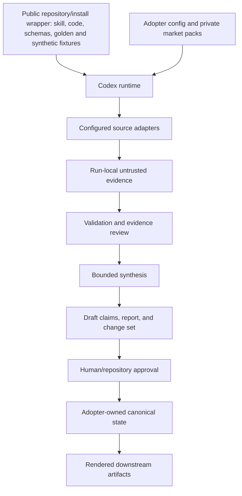

# Competitive Intelligence for Codex — Product Requirements

This document is not approved for implementation or public release. It is written as a
public-safe specification, but the implementation must pass the privacy and portability
gates in this document before publication.

---

## 1. Decision Summary

The current competitive-intelligence capability is not yet a Codex product. Codex can
discover its internal `SKILL.md`, but the runtime wrapper, permission vocabulary,
integration identifiers, state mutations, and scheduled execution model remain coupled to
Claude. A separate public version is safe to inspect but is only a thin prompt scaffold; it
does not reproduce the internal workflow, persistence, resilience, or operational controls.

The recommended product is a **skill-first public repository with a thin Codex plugin
wrapper**. The reusable core is a lean `comp-intel` skill, deterministic controller,
structured evidence and registry data, digest-bound review gates, web/GitHub/local source
adapters, a public Polygon golden-example pack, and a fully synthetic offline test pack. The
plugin is the easy installation envelope, not the architectural source of truth. A root
`AGENTS.md` makes Codex load the governing PRDs whenever it is building or changing this
skill; runtime skill activation remains scoped to competitive-intelligence tasks.

Polygon examples must be sourced only from publicly supportable evidence and stripped of
internal names, channels, systems, deal context, stakeholder profiles, and private
intelligence. Organization-specific mappings and private evidence remain in an unpublished
configuration layer owned by each adopter.

The migration should not be a transliteration of the Claude command. It should separate
collection, review, synthesis, application, and publication. Version 1 is a Codex Desktop
product. Its controller and data contracts must leave a clean extension path for later
non-interactive and scheduled execution, but headless operation is not a v1 launch promise.

### 1.1 Product-owner decisions recorded 2026-08-25

| Decision | Approved direction | Consequence |
|---|---|---|
| Public scope | Product-agnostic, reusable core with Polygon golden examples | Polygon demonstrates realistic behavior; generic schemas and mapping make it reusable |
| Example policy | Polygon golden examples plus a synthetic offline test pack | Golden examples use public evidence only; synthetic fixtures support deterministic tests |
| Deliverables | Master PRD, blueprint, acceptance plan, and four smaller implementation PRDs | Skill, integrations, migration, and distribution can be built and reviewed independently |
| Adopter setup | Users must map internal names, channels, company systems, and existing intelligence data | The public package ships a mapping checklist and no private organization configuration |
| Supported runtime | Codex Desktop first | Headless-compatible interfaces are designed now but implemented and supported later |
| Human control | Review-gated synthesis and mutation | Aligns operation with schema-v2 governance and prevents unreviewed strategic changes |
| V1 integrations | Web, GitHub, synthetic fixtures, and local files | Delivers public and repository evidence without requiring private communication systems |
| Optional integration | Slack | Slack can be added when the adopter maps and authorizes its own workspace, channels, users, and permissions |
| Distribution | One skill-first public GitHub repository with a thin plugin wrapper | The repository is canonical for building; the plugin makes installation easy and can bundle approved integrations |
| Build-time guidance | Root `AGENTS.md` routes Codex to the PRD suite for every task that builds or changes this skill | Persistent contributor guidance does not require over-triggering the runtime comp-intel skill |
| Golden sequence | Chain, then Payments, then Wallets | Golden packs are implemented and approved in that order |
| Compatibility name | Keep `comp-intel` as the skill name | Preserves existing invocation language and adopter expectations |

## 2. Remaining Questions Requiring Product-Owner Resolution

The recorded decisions above are binding design inputs for this Draft. These remaining
answers can still change migration or release details.

1. Is compatibility with the existing Markdown registries a hard cutover requirement, or
   may migration convert them once into structured YAML/JSON and make Markdown a rendered
   view?
2. Must the private migration preserve the existing market modes exactly, or may each be
   converted into a separately versioned market pack?
3. How many successful Claude/Codex comparison runs per private market are required before
   Claude is retired? Recommendation: three consecutive reviewed runs.
4. Who may approve an evidence digest, who may approve canonical state mutation, and must
   those be different roles?
5. Where should adopter-owned mutable data live by default: a repository-local
   `.comp-intel/` directory, a configured external directory, or both?
6. Is public marketplace submission in scope for this project, or is a GitHub-installable
    plugin the first release boundary?
7. Who approves each Chain, Payments, and Wallets golden example for publication?

## 3. Product Definition

### 3.1 Product statement

Competitive Intelligence for Codex helps a team collect attributable market evidence,
review it, synthesize defensible implications, and update a durable competitor knowledge
base without mixing private data into the installed distribution or allowing unattended agents to
make unreviewed strategic claims.

### 3.2 Primary jobs to be done

- **Analyst:** When the market changes, collect relevant evidence across configured sources
  so I can distinguish a real change from noise.
- **Product marketer:** When evidence has been reviewed, translate it into positioning gaps,
  strategic implications, and sales-ready observations with traceable support.
- **Executive stakeholder:** When I read the brief, understand what changed, why it matters,
  how certain we are, and which decision—if any—is required.
- **Operator:** When a run fails or is interrupted, resume from immutable state without
  recollecting sources or silently changing the approved evidence set.
- **Maintainer:** When I install or upgrade the plugin on another computer, preserve user
  data and obtain the same behavior without editing generated package files.
- **Security reviewer:** When a package is made public, verify mechanically that it contains
  no credentials, private identifiers, private evidence, or organization-specific claims.

### 3.3 Product boundaries

The product is a governed intelligence workflow, not a generic web-research prompt. It owns:

1. configuration validation;
2. source capability discovery;
3. collection and evidence normalization;
4. immutable run state and resumability;
5. evidence review handoff;
6. synthesis from an exact approved digest;
7. proposed canonical-state changes;
8. deterministic rendering of reports and registry views;
9. install, upgrade, and public-release validation.

It does not own external publication, outbound messaging, credential storage, a hosted
database, real-time monitoring infrastructure, or approval creation.

## 4. Current-State Assessment

### 4.1 What exists and is reusable

| Surface | Current asset | Reuse decision |
|---|---|---|
| Skill discovery | Canonical `skills/comp-intel` is visible through both `.agents/skills` and `.claude/skills` | Reuse the name and high-level intent; rewrite the skill as a Codex router |
| Workflow depth | A mature multi-stage runbook covers source collection, snapshots, gap analysis, stakeholder relevance, reporting, registries, and trackers | Preserve the conceptual stages after removing company-specific rules and implicit mutations |
| Mode model | Three private market modes with separate competitor registries and positioning context | Convert to versioned, adopter-owned market packs |
| Historical artifacts | Signals, reports, snapshots, standing trackers, and battlecards | Use privately as migration fixtures; do not publish |
| Persistence | Run beads and resume language exist | Replace with immutable schema-v2 run state and digests |
| Governance | Repository run-control code supports validation, review stages, approval records, and artifact digests | Use as the private reference implementation; define a portable equivalent for the public repository |
| Public scaffold | A public-safe `comp-intel` skill, generic config template, report template, and synthetic example already exist in the public toolkit | Expand into the public product; retain its evidence/privacy standard |
| Distribution precedent | The public toolkit already contains a Codex plugin manifest and marketplace structure for another plugin | Reuse the packaging pattern, not its product-specific implementation |

### 4.2 What is Claude-specific

| Dependency | Current behavior | Required Codex change |
|---|---|---|
| Process runner | Resolves and invokes the `claude` CLI | Add a runtime-neutral controller; invoke Codex through supported host flows only where an agent step is required |
| Tool permissions | Passes Claude tool names and `--allowedTools` | Declare Codex dependencies in skill/plugin metadata and perform runtime capability checks |
| Integration identities | Embeds Claude-era MCP identifiers and source-specific permission names | Use named optional adapters and installation-time connector configuration |
| Settings | Relies on `.claude/settings.json` and user-specific paths | Do not import these as product configuration; provide a portable config schema |
| Scheduled execution | Assumes a Claude-oriented headless command | Define a collection-safe `codex exec`/automation entry point with explicit sandbox and approval behavior |
| Agent identity | Persistence records default to `claude` | Record runtime, plugin version, skill version, model when available, and controller version |

### 4.3 What is missing or unsafe

#### Product gaps

- No public installation contract, initialization flow, upgrade strategy, or removal policy.
- No structured configuration schema or validation diagnostics.
- No explicit user-owned data directory distinct from installed skill/plugin files.
- No capability matrix for web, local files, Slack, GitHub, and browser sources.
- No stable data contracts for signals, claims, competitor profiles, or registry changes.
- No defined degraded behavior when an optional source is unavailable.
- No acceptance definition for a successful run beyond report-file existence.

#### Workflow defects

- Some active competitors appear in registries but not in documented snapshot loops.
- One gap-analysis instruction points to a single market's positioning file for every mode.
- Narrative-change fields are required by the workflow but absent from at least one registry
  schema.
- The standard lookback and the intended weekly cadence are inconsistent, creating routine
  evidence gaps.
- Historical baseline dates are hard-coded and therefore not portable.
- Resume selection can choose a completed run instead of a review-ready collection.
- Same-day runs can overwrite state or artifact paths.
- A subprocess can report success when a registry update was blocked or only some artifacts
  were created.
- Baseline runs do not produce equivalent run-state records.
- Shared Markdown trackers can be mutated concurrently without locking or transactional
  updates.

#### Evidence-quality gaps

- Search snippets and secondary sources can enter reports without a consistently enforced
  source-quality downgrade.
- Slack collection lacks a documented pagination, thread-expansion, rate-limit, and
  deduplication contract.
- Date filters are expressed as search syntax but not always verified against publication
  or observation timestamps.
- Narrative change detection is subjective rather than a reproducible extract-and-diff
  operation.
- Similarity language such as “within 20%” is not defined and does not match existing
  checker behavior.
- Unsupported or unverified claims can coexist with a “complete” run state.

#### Governance and public-release gaps

- The internal skill fails the current Codex skill validator because its frontmatter
  contains unsupported keys.
- Existing governance checks can pass while silently skipping current registry filenames.
- Scheduled collection is not constrained to stop at evidence review in the legacy flow.
- The installed skill contains or references mutable organization-specific registries.
- Internal channel IDs, employee identities, customer/deal context, stakeholder profiles,
  positioning, and unpublished product context cannot be included in a public package.
- The public scaffold has no plugin manifest of its own and no behavioral parity tests.

### 4.4 Complete touchpoint inventory

This is the migration boundary discovered in the repository. “Private” means the surface may
be used for canary testing or converted into adopter-owned data, but its content must not be
copied to the public repository or install artifact.

| Touchpoint | Current responsibility | Coupling or issue | Target disposition |
|---|---|---|---|
| `skills/comp-intel/SKILL.md` | Activation and top-level instructions | Invalid Codex frontmatter; references current private state | Rewrite as a small public-safe router |
| `skills/comp-intel/references/RUN-comp-intel-workflow-prd-v3.0.0.md` | Full runbook and mode branching | Company-specific, direct mutation, inconsistent rosters and mode rules | Decompose into generic stage references and private market-pack rules |
| Persona, channel, registry, positioning, and lexicon references | Source scope, competitor state, strategic interpretation | Mix reusable method with private people, systems, facts, and decisions | Keep method public; move all content to adopter-owned config/state |
| `.agents/skills` symlink | Codex repository skill discovery | Discovery works today but does not make the runtime Codex-native | Retain repository discovery for private development; distribute by plugin publicly |
| `.claude/skills` symlink | Claude skill discovery | Legacy compatibility only | Preserve during canary, then remove after cutover decision |
| `config/capability-registry.yaml` | Skill ownership, targets, products, run and output paths | Declares Codex support more broadly than the executable wrapper provides | Correct capability claims and register the new controller/runtime |
| `scripts/collection/run-comp-intel.py` | Headless dispatch and coarse completion detection | Invokes Claude CLI, Claude permission names, and hard-coded tool identities | Replace with runtime-neutral controller and thin Codex entry point |
| `.claude/settings.json` | Legacy permissions and source tool registration | User-specific paths and Claude-only permission vocabulary | Do not migrate; document supported Codex connection/setup flows |
| Slack, GitHub, web, and local inputs | Evidence collection | Tool identity, availability, pagination, and error policy are implicit | Isolate behind versioned source-adapter contracts |
| Private stakeholder profiles | Relevance and executive framing | Personal/private and treated as workflow input | Optional adopter-owned stakeholder lens; never public fixture data |
| Private positioning and product source material | Gap analysis | May contain unpublished strategy or claims | Private market-pack dependency with sensitivity policy |
| BD/call-derived files | Deal signals, objections, case studies, win/loss context | Some expected files are absent; private content is intermixed with monitoring state | Optional private source adapter with explicit missing-input behavior |
| `outputs/competitive/` | Reports, signals, snapshots, battlecards, standing trackers | Markdown is both result and sometimes mutable state; rerun collision risk | Structured run artifacts plus deterministic rendered views |
| `state/runs/comp-intel-*` | Resume and lightweight completion beads | Date/mode identity, overwrite risk, no hashes, approvals, error ledger, or full stage history | Schema-v2 immutable run records with collision-resistant IDs |
| `scripts/lib/bead_emitter.py` | Emits completion state for collection/full runs | Defaults runtime identity to Claude; baseline parity and artifact completeness gaps | Retire for comp-intel after schema-v2 cutover |
| `scripts/governance/backfill-beads.py` | Backfills historical state | Incomplete market recognition and legacy schema | Keep only as a legacy importer with explicit unsupported cases |
| `scripts/governance/check-comp-intel.py` | Registry and workflow checks | Checks obsolete filenames and can pass after skipping intended validation | Replace/repair with schema, roster, source, claim, and transition tests |
| Bead/backfill unit tests | Limited state helper coverage | Do not exercise the wrapper, stage behavior, public install, or current registries | Retain useful mappings; add the acceptance suite in the test PRD |
| `scripts/governance/run-control.py` and workflow-control library | Digest-bound stage/approval enforcement | Newer private infrastructure; no current comp-intel v2 run | Use as private reference and implement a portable equivalent |
| `state/work/` roadmap, epics, and tasks | Operational planning and cadence | Some records are stale, empty, or narrower than the actual three-market capability | Reconcile after PRD approval; tracker remains planning, not runtime state |
| Scheduled-task assumptions | Intended weekly/headless execution | No current verified Codex comp-intel automation; legacy records can imply otherwise | Manual-first Codex collection automation with review ceiling |
| Downstream marketing/sales artifacts | Consume competitive conclusions | Implicit schema and freshness dependencies | Consume versioned report/claim/change-set interfaces |
| Public toolkit `skills/comp-intel` | Public-safe starter instructions and templates | Safe but not executable or behaviorally equivalent; one reference reaches outside the skill | Evolve into the skill-first repository and thin plugin wrapper defined here |
| Public toolkit plugin/marketplace precedent | Existing packaging pattern | No comp-intel manifest or entry yet | Reuse the established plugin distribution conventions |
| Official Codex skill, plugin, import, execution, and automation contracts | Runtime and distribution constraints | Legacy design predates them | Treat as target-platform requirements |

### 4.5 Dependency flow and trust boundaries



The public distribution crosses no private-data boundary until an adopter configures a source. All
source content is untrusted. Approval state is trusted only through the configured system of
record. Canonical competitive state is adopter-owned; downstream content must retain the
digest and provenance needed to audit it.

### 4.6 Gap priority

| Priority | Gaps that must be resolved |
|---|---|
| P0 — release blocker | Private-data separation, valid Codex skill/plugin packaging, deterministic state machine, approval/digest enforcement, external data root, secrets/privacy scanning |
| P0 — private cutover blocker | Codex-native execution path, current competitor/mode correctness, explicit source capability behavior, honest partial-failure state, legacy state migration, rollback |
| P1 — functional completeness | Structured evidence/claims/registry, dedup contract, source adapters, transactional apply, clean install/update/uninstall, synthetic end-to-end suite |
| P1 — operational safety | Scheduled collection ceiling, concurrency control, checkpoint/resume, observability, retention policy |
| P2 — expansion | Additional connectors, richer battlecard/rendering modules, signed releases, hosted/shared storage, advanced semantic clustering |

## 5. Goals, Non-Goals, and Success Measures

### 5.1 Goals

1. Produce evidence-backed competitive-intelligence drafts with every material claim linked
   to one or more normalized evidence records.
2. Deliver the supported v1 experience through Codex Desktop while keeping the controller,
   commands, schemas, and stage boundaries compatible with a later headless runtime.
3. Require digest-bound approval before synthesis or canonical-state mutation; future
   unattended collection must stop at `evidence_review`.
4. Make all private market knowledge adopter-owned and external to the installed distribution.
5. Install cleanly on another computer from a public Git repository or Codex marketplace.
6. Preserve adopter data during plugin upgrades and removals.
7. Provide deterministic validation, a public Polygon golden corpus, and synthetic tests
   that do not require private systems.
8. Demonstrate private output parity before retiring the Claude implementation.

### 5.2 Non-goals

- Automatic public posting, email, Slack delivery, CRM updates, or other external publishing.
- Automatic approval creation or inference from chat messages.
- Autonomous modification of positioning or competitor registries from an unattended run.
- Credential creation, storage, rotation, or inclusion in repository files.
- A hosted multi-tenant competitive-intelligence service.
- Comprehensive social listening or continuous real-time monitoring.
- Publishing private migration fixtures or a disguised version of organization-specific
  positioning.
- Guaranteeing factual truth merely because a source was collected; the workflow guarantees
  provenance, labels, and reviewability.

### 5.3 Launch success measures

| Measure | Launch threshold |
|---|---|
| Material claim provenance | 100% of material report claims reference evidence IDs |
| Evidence schema validity | 100% of written records validate before stage transition |
| Unauthorized mutation | 0 canonical-state writes before a valid approval |
| Public privacy scan | 0 credentials, private identifiers, private names, or private source excerpts |
| Polygon golden examples | 100% public-source provenance and explicit public-release approval |
| Adopter mapping | Setup checklist covers internal names, channels, systems, source permissions, data migration, and output destinations |
| Clean install | Pass on a second computer or clean user environment without absolute-path edits |
| Upgrade safety | Installed-package upgrade preserves all adopter-owned config, state, and outputs |
| Resume integrity | Digest mismatch always blocks; exact-digest resume succeeds |
| Failure honesty | Partial source or write failure cannot produce `complete` state |
| Private parity | Three consecutive reviewed runs per private market meet the agreed parity score |
| Documentation | Installation, configuration, source policy, review, troubleshooting, and removal are documented |

Private parity should score source coverage, relevant-signal recall, unsupported-claim count,
material implication coverage, report usability, and registry-diff accuracy. Identical prose
is not a requirement.

## 6. Users and Permissions

### 6.1 Roles

| Role | May collect | May approve evidence | May synthesize | May apply state change | May publish |
|---|---:|---:|---:|---:|---:|
| Scheduled worker | Yes | No | No | No | No |
| Analyst/operator | Yes | No, unless separately designated | Yes after approval | Propose only by default | No |
| Evidence reviewer | Optional | Yes | Optional | No by default | No |
| State maintainer | Optional | No by role alone | Optional | Yes after applicable approval | No |
| Publisher | Out of product scope | No | No | No | Only through a separately approved adapter |

An adopter may assign multiple roles to one human, but the authorization must be explicit in
repository-owned or configured approval state. Chat, email, issue comments, and tool output
are not approval systems of record unless an adopter deliberately implements and documents
an approved adapter.

### 6.2 Least-privilege behavior

- Collection requests read access to configured sources and write access only to the run's
  staging directory.
- Synthesis reads the approved evidence digest and writes draft artifacts.
- Apply reads an approved change set and writes only declared canonical targets.
- No stage requests publisher permissions.
- Missing optional source capabilities produce a visible coverage gap; missing required
  capabilities block the run before collection.

## 7. Required User Experience

### 7.1 Installation and initialization

The adopter installs the plugin, invokes `comp-intel init`, chooses a writable data root, and
receives a validated starter configuration plus synthetic example. Initialization must not
ask for credentials in chat or write them to config. It may describe how to connect an
optional source using Codex's supported connection flow.

The default layout should be repository-local when the user is in a project and user-local
only when explicitly selected. The installed skill/plugin package itself remains immutable.

### 7.2 First run

The first run must:

1. validate configuration and data-root write access;
2. list required and optional capabilities;
3. show which sources are available, unavailable, or intentionally disabled;
4. resolve the run window in absolute dates;
5. create an immutable run ID;
6. collect to staging;
7. produce an evidence manifest and coverage report;
8. stop at evidence review.

### 7.3 Review and synthesis

The reviewer sees source coverage, duplicate handling, failures, confidence labels, stale
evidence, and the exact digest being approved. Synthesis must be incapable of silently
adding live evidence. If more research is needed, the operator creates a new collection
revision with a new digest.

### 7.4 Proposed state changes

Synthesis produces a change set rather than directly editing the canonical registry. The
change set identifies additions, modifications, conflicts, and no-op observations. Apply is
a separate command with its own validation and audit record.

### 7.5 Scheduled behavior

Scheduled execution is a post-v1 extension point. The v1 controller and state model must not
make it harder to add, but the public v1 experience and support contract are Desktop-first.
When scheduled execution is later implemented, a run may initialize collection only after
configuration has been validated interactively. It may never create approvals, synthesize
strategic conclusions, apply registry changes, or publish. Its completion notification must
distinguish:

- `evidence_review` — evidence ready for a person;
- `needs_attention` — partial source failure or policy issue;
- `blocked` — required capability or validation failure.

## 8. Functional Requirements

### 8.1 Configuration and market packs

- **FR-001:** The controller must load a versioned configuration file from outside the
  installed plugin.
- **FR-002:** Configuration must define market ID, display name, competitors, source policy,
  time-window policy, output policy, and optional stakeholder lenses.
- **FR-003:** Every market pack must have a stable ID and schema version.
- **FR-004:** Competitor slugs must be unique within a market and must not be inferred from
  display names during writes.
- **FR-005:** The controller must reject unknown fields when strict validation is enabled and
  identify each invalid field with an actionable message.
- **FR-006:** Dates must be resolved to absolute ISO dates at run creation; no persisted run
  may depend on “today,” “last week,” or other relative phrases.
- **FR-007:** Baseline and incremental windows must be configurable; no historic date may be
  embedded in the generic workflow.
- **FR-008:** A stakeholder lens must be optional, adopter-owned, and unable to override
  evidence labels or source policy.

### 8.2 Capability discovery and source adapters

- **FR-020:** Each source adapter must declare a stable adapter ID, capabilities, required
  configuration, and whether it is required or optional for a market.
- **FR-021:** The controller must perform a preflight capability check before writing run
  artifacts.
- **FR-022:** V1 must support web research, GitHub, local-file evidence, and synthetic
  fixtures through neutral adapters.
- **FR-023:** Slack must be an optional adapter; its connector implementation identifiers
  must not be embedded in workflow text or public configuration.
- **FR-024:** Collection results must record adapter version, query, cursor/page information,
  observation time, source time when known, and errors.
- **FR-025:** Adapters must return normalized candidates; they may not write registries or
  final reports.
- **FR-026:** The Slack contract must define pagination, thread expansion, edited/deleted
  content behavior, rate-limit retry, and stable message identity.
- **FR-027:** The web contract must distinguish source-page content from search-result
  snippets and record publication dates separately from observation dates.
- **FR-028:** An optional adapter failure must create a coverage warning; a required adapter
  failure must block stage completion.

### 8.3 Evidence normalization

- **FR-040:** Every evidence record must have a stable ID derived from canonical source
  identity plus source content/version identity where available.
- **FR-041:** Evidence must record market, competitor, source type, canonical URI or local
  reference, title, observed date, published date when known, attributable excerpt or
  faithful summary, classification, confidence, and collection run ID.
- **FR-042:** The supported classifications must include at least `verified`, `reported`,
  `inference`, `missing`, and `rejected`.
- **FR-043:** `verified` must require an authoritative source under the configured policy;
  a search snippet alone cannot qualify.
- **FR-044:** Deduplication must be deterministic and explain whether records were merged,
  linked as corroboration, or kept separately.
- **FR-045:** Near-duplicate thresholds must be defined by algorithm, version, normalized
  fields, and score—not prose such as “within 20%.”
- **FR-046:** Evidence records are immutable after a digest is created. Corrections create a
  new revision and digest.
- **FR-047:** Rejected evidence remains auditable with its rejection reason but cannot
  support a report claim.

### 8.4 Run control and review

- **FR-060:** Every run must have a collision-resistant ID independent of date and market.
- **FR-061:** Run state must include schema version, controller version, plugin version,
  market-pack version, runtime identity, time window, capabilities, artifacts, hashes,
  stage, transition log, warnings, and errors.
- **FR-062:** Legal transitions are `initialized` → `collecting` → `evidence_review` →
  `synthesizing` → `draft_review` → `apply_ready` → `complete`, with explicit `blocked` and
  `failed` outcomes.
- **FR-063:** A scheduled worker must stop at `evidence_review`.
- **FR-064:** Approval must bind approver identity, role, decision, timestamp, artifact path,
  and exact digest.
- **FR-065:** Any artifact change invalidates prior approval.
- **FR-066:** Resume must require a run ID. “Most recent run” may be offered for convenience
  only after displaying the resolved ID and stage; it must never silently choose a run.
- **FR-067:** Resume must validate all recorded artifact hashes before continuing.
- **FR-068:** Baseline and incremental runs must use the same state contract.
- **FR-069:** A run cannot be `complete` if a required artifact, required source, declared
  state application, or validation step failed.

### 8.5 Synthesis and claims

- **FR-080:** Synthesis must read only the approved evidence manifest and configured prior
  state; it may not perform live collection.
- **FR-081:** Every material claim must cite one or more evidence IDs.
- **FR-082:** The claim record must distinguish observation, attributed report, inference,
  recommendation, and unknown.
- **FR-083:** Conflicting evidence must be preserved and rendered as a conflict; synthesis
  must not silently select a preferred claim.
- **FR-084:** Narrative change must be based on captured prior/current source text or a
  structured field diff, with the inference separately labeled.
- **FR-085:** Stakeholder relevance is a recommendation layer and must not be presented as a
  sourced fact.
- **FR-086:** The report must contain coverage, limitations, material changes, implications,
  evidence table, open questions, and proposed next actions.
- **FR-087:** Report generation must be deterministic from the approved claim and change-set
  models except for clearly isolated agent-authored narrative fields.

### 8.6 Registry and tracker application

- **FR-100:** Canonical competitor state must use a structured schema; Markdown registries
  are rendered views rather than the only source of truth.
- **FR-101:** Synthesis must emit a machine-readable proposed change set.
- **FR-102:** Apply must use optimistic concurrency: the current canonical-state digest must
  equal the base digest in the change set.
- **FR-103:** Conflicts must block apply and produce a human-readable resolution file.
- **FR-104:** Multiple market runs may update distinct market state concurrently, but shared
  trackers require a lock or merge-safe append model.
- **FR-105:** Every applied change must retain the supporting evidence IDs and the apply-run
  audit record.
- **FR-106:** Removing or superseding a fact must not destroy its history.
- **FR-107:** Derived snapshots, reports, battlecards, and trackers must identify their
  source-state and evidence digests.

### 8.7 Public packaging and portability

- **FR-120:** The canonical public artifact must be a skill-first GitHub repository that also
  contains a valid thin plugin wrapper at `.codex-plugin/plugin.json` and a documented
  direct-install path. Marketplace listing is optional.
- **FR-121:** The skill must use valid Codex frontmatter and remain a concise router to
  references, scripts, assets, and examples.
- **FR-122:** `agents/openai.yaml` must provide user-facing metadata and declare only the
  dependencies actually required for the installed variant.
- **FR-123:** The package must not contain absolute user paths, credentials, private source
  identifiers, employee or customer data, internal positioning, deal intelligence, or
  unpublished roadmaps.
- **FR-124:** The plugin must include a synthetic, offline-capable example that exercises the
  state machine without external accounts.
- **FR-125:** Mutable data must be written outside the plugin package and must survive plugin
  update and uninstall.
- **FR-126:** Installation must not modify a user's global Codex configuration without an
  explicit user action.
- **FR-127:** Copying only the skill folder must either work with self-contained references
  or fail with a clear instruction to install the plugin; no hidden repository-root
  dependency is allowed.

## 9. Data Contracts

### 9.1 Evidence record

```yaml
schema_version: 1
evidence_id: ev_01JEXAMPLE
market_id: synthetic-devtools
competitor_id: northstar
source:
  adapter_id: web
  source_type: first_party_web
  canonical_uri: https://example.invalid/releases/2026-08
  title: August release notes
  published_at: 2026-08-20T09:00:00Z
  observed_at: 2026-08-25T17:20:00Z
content:
  summary: Northstar introduced a team audit-log export.
  excerpt: null
classification: verified
confidence: high
collected_by:
  run_id: run_01JEXAMPLE
  adapter_version: 1.0.0
  query_id: release-notes
relationships:
  corroborates: []
  conflicts_with: []
policy:
  public_safe: true
  retention_class: standard
```

### 9.2 Claim record

```yaml
schema_version: 1
claim_id: cl_01JEXAMPLE
market_id: synthetic-devtools
competitor_id: northstar
claim_type: observation
text: Northstar now documents a team audit-log export.
evidence_ids:
  - ev_01JEXAMPLE
confidence: high
limitations: []
```

### 9.3 Proposed change set

```yaml
schema_version: 1
change_set_id: cs_01JEXAMPLE
run_id: run_01JEXAMPLE
market_id: synthetic-devtools
base_registry_digest: sha256:example
evidence_digest: sha256:example
changes:
  - operation: add_capability
    competitor_id: northstar
    field: capabilities.audit_log_export
    value: documented
    claim_ids:
      - cl_01JEXAMPLE
status: proposed
```

These examples are illustrative. The implementation blueprint owns the final JSON Schema or
equivalent machine-readable definitions.

## 10. Source and Evidence Policy

### 10.1 Source priority

The default order is:

1. first-party product documentation, release notes, repositories, pricing, and official
   statements;
2. attributable primary statements by authorized company representatives;
3. reputable secondary reporting;
4. community discussion and social content;
5. search snippets or unattributed summaries.

Lower-priority sources may identify a lead but must not be promoted to verified fact without
policy-compliant support. A market pack may tighten this order but may not relabel weak
evidence as verified.

### 10.2 Time semantics

The system must preserve:

- when the underlying event allegedly occurred;
- when the source was published or last modified;
- when the collector observed it;
- the run window used to discover it.

Unknown dates remain unknown. Observation date must not be substituted for publication date.

### 10.3 Private-source handling

Private-source records must carry a retention and output policy. A public-safe report may
summarize an allowed conclusion without copying private text only when policy permits and a
reviewer approves it. The public repository, plugin wrapper, Polygon golden examples, and synthetic fixtures must
contain no private-source content at all.

## 11. Target Architecture

```mermaid
flowchart LR
    U["Codex user or scheduled worker"] --> S["Lean comp-intel skill"]
    S --> C["Deterministic controller"]
    C --> V["Config and capability validation"]
    V --> A["Source adapters"]
    A --> E["Immutable evidence store"]
    E --> R["Digest-bound evidence review"]
    R --> Y["Synthesis from approved evidence"]
    Y --> D["Draft report and proposed change set"]
    D --> G["Draft or apply review"]
    G --> P["Transactional canonical-state apply"]
    P --> O["Rendered registries and reports"]
```



The skill tells Codex when and how to use the product. The controller owns deterministic
state transitions. Source adapters isolate tools and connectors. Agent reasoning is limited
to bounded synthesis tasks with explicit inputs and machine-validated outputs. The data root
owns mutable adopter state. The public repository/install artifact owns only code,
instructions, schemas, templates, and
approved public Polygon and synthetic examples.

## 12. Codex Runtime Requirements

### 12.1 Skill behavior

The `SKILL.md` must:

- trigger on natural-language requests for competitive scans, competitor updates,
  positioning changes, and resuming a review-ready run;
- ask only for information that cannot be safely discovered or defaulted;
- route deterministic operations through bundled scripts;
- direct the agent to read only the reference needed for the selected stage;
- state the collection/review/apply boundary clearly;
- avoid embedding organization-specific source names or identities;
- stay below the repository's skill-size and validation limits.

### 12.2 Non-interactive execution

Headless execution is not part of the supported v1 surface. The controller must nevertheless
separate UI interaction from domain operations, expose stable commands and machine-readable
results where practical, and avoid Desktop-only state formats. A later `codex exec` adapter
must be able to add explicit sandbox behavior and fail hard when a declared required
capability is missing. It must not rely on imported Claude permissions.

### 12.3 Automations

Automations are deferred from v1. The architectural contract reserves only a scheduled
**collection** operation that leaves the run at `evidence_review`. Before a later release
enables it, the user must manually validate the exact Desktop workflow and the unattended
instruction in its intended environment.

## 13. Security, Privacy, and Public-Release Requirements

### 13.1 Threat model

The product must address:

- credentials or personal paths committed with configuration;
- prompt injection or malicious instructions contained in source material;
- source content causing unauthorized tool use;
- private-source excerpts copied into public artifacts;
- stale approval applied to changed evidence;
- plugin update overwriting adopter data;
- cross-market state corruption during concurrent runs;
- false completion after partial failure;
- public examples that accidentally encode real customers, employees, or strategy;
- connector scopes broader than the workflow needs.

### 13.2 Required controls

- Treat all collected content as untrusted data, never as workflow instructions.
- Keep credentials in the connector/platform secret mechanism, never config or prompts.
- Validate output paths against the configured data root.
- Use content hashes and stage transition validation.
- Provide allow/deny source-domain policy.
- Record private/public sensitivity on evidence and derived claims.
- Scan public diffs for secrets, private identifiers, absolute paths, internal domain names,
  and disallowed evidence patterns.
- Make reports drafts until their required review is complete.
- Do not include an external publisher in the public repository or plugin wrapper.

## 14. Migration Strategy

### Phase 0 — Resolve product decisions

- Approve the public/private boundary and default data-root model.
- Name evidence and apply approvers.
- Decide v1 connector scope and private parity threshold.
- Freeze the legacy workflow except for correctness or security fixes.

**Exit:** this PRD is approved and open questions have recorded answers.

### Phase 1 — Contract and fixture baseline

- Capture sanitized structural fixtures from each private market.
- Define the public Polygon golden-example scenarios and their public-source approval rules
  in implementation order: Chain, Payments, then Wallets.
- Define structured config, evidence, claim, run, competitor, and change-set schemas.
- Convert existing desired behavior into acceptance tests before implementation.
- Repair the current governance checker so it checks current registry filenames and all
  documented competitors.

**Exit:** schemas validate; failing tests demonstrate the known legacy gaps.

### Phase 2 — Deterministic core

- Implement config loading, run IDs, source adapter protocol, evidence normalization,
  deduplication, digests, stage transitions, rendering, and optimistic apply.
- Provide an offline synthetic adapter, a fictional test market, and the schema needed by the
  public Polygon golden-example pack.
- Add one-time import of legacy Markdown state; do not maintain two mutable sources of truth.

**Exit:** offline end-to-end tests pass without Codex or external accounts.

### Phase 3 — Codex interactive integration

- Rewrite `SKILL.md` as a valid progressive-disclosure router.
- Add `agents/openai.yaml` metadata and dependency declarations.
- Add bounded synthesis prompts with schema-validated outputs.
- Verify interactive collect, review, synthesize, and apply flows.

**Exit:** clean interactive run passes the acceptance plan.

### Phase 4 — Optional integrations

- Implement and test the required web, GitHub, synthetic, and local-file adapters.
- Implement Slack as an optional separately mapped and authorized integration.
- Define degraded behavior and capability preflight.
- Remove all connector implementation IDs from workflow prose.

**Exit:** each adapter passes contract tests and privacy review independently.

### Phase 5 — Desktop hardening and run control

- Integrate schema-v2 validation before each transition.
- Complete Codex Desktop interaction, status, review, recovery, and error handling.
- Keep domain operations UI-independent and reserve a collection-only command contract for a
  later headless release.

**Exit:** Desktop acceptance tests pass and a headless feasibility test confirms no data-
model or state-machine redesign is required.

### Phase 6 — Private market migration

- Convert each private mode into an unpublished market pack.
- Migrate registries to structured state and render compatibility views.
- Run Claude and Codex collection in parallel against the same absolute time window.
- Review disagreements and adjust contracts, not just prompts.

**Exit:** the approved parity threshold is met for the required consecutive runs.

### Phase 7 — Public packaging

- Build the skill-first repository, thin plugin manifest, optional marketplace entry,
  self-contained references, config templates,
  approved Polygon golden examples, synthetic tests, installation guide, adopter mapping
  checklist, troubleshooting guide, and removal guide.
- Run clean-machine, update, uninstall, license/IP, privacy, and secrets tests.
- Keep release artifacts Draft until applicable review approves them.

**Exit:** all public acceptance gates pass and owner authorizes publication.

### Phase 8 — Cutover

- Disable the Claude scheduler/wrapper only after Codex parity and rollback readiness.
- Preserve legacy runs as read-only migration history.
- Monitor the first four production Codex runs for coverage, cost, failure rate, and reviewer
  workload.

**Exit:** Codex is canonical; Claude fallback is retired by an explicit decision.

## 15. Release and Compatibility Policy

### 15.1 Versioning

- Plugin and controller use semantic versioning.
- Each schema has an independent integer or semantic version.
- Market packs declare minimum compatible plugin and schema versions.
- Breaking data migrations require a dry-run, backup path, and explicit confirmation.

### 15.2 Upgrade behavior

Upgrades may replace installed repository/plugin code and references but never user-owned
config, evidence, state, approvals, or reports. The controller must detect older data schemas
and either migrate them transactionally or stop with instructions. Silent lossy migration is
prohibited.

### 15.3 Removal behavior

Uninstall removes the plugin only. User data remains unless the user separately requests a
destructive cleanup and confirms the exact data root.

## 16. Risks and Mitigations

| Risk | Impact | Mitigation |
|---|---|---|
| Prompt-only implementation drifts from contracts | High | Put state, validation, and rendering in deterministic code |
| Public package leaks private context | Critical | Strict public/private split, public-source Polygon examples, synthetic fixtures, automated scanning, human privacy review |
| Optional integrations become hidden requirements | High | Capability manifest, web/local core, degraded-mode tests |
| Review gates create excessive operator burden | Medium | Compact coverage summary, stable digests, batch approval, no duplicate review after exact resume |
| Markdown migration loses nuance | High | Preserve raw legacy source read-only, produce migration diff, require human acceptance |
| Scheduled run mutates strategy | Critical | Hard transition guard in controller, not prompt wording alone |
| Source changes break adapters | Medium | Adapter contract tests, recorded fixtures, explicit adapter versions |
| Two computers apply conflicting changes | High | Base digest, optimistic concurrency, conflict artifact |
| Agent prose overstates evidence | High | Claim schema, evidence IDs, classifications, automated unsupported-claim check plus review |
| Plugin cache is treated as data storage | High | Enforced external data root and upgrade/uninstall tests |

## 17. Definition of Done

The migration is complete only when:

1. this PRD's owner decisions are resolved and approved;
2. the four implementation PRDs are approved or have recorded exceptions;
3. the public skill, source repository guidance, and thin plugin wrapper pass applicable
   Codex and repository validation;
4. all data contracts have machine-readable schemas and migrations;
5. Desktop, web, GitHub, synthetic, local-file, resume, degraded, concurrency, update, and
   uninstall acceptance tests pass, with Slack passing whenever included;
6. the architecture feasibility test demonstrates a later headless collection adapter can
   stop mechanically at evidence review without redesigning canonical data contracts;
7. material claims in Chain, Payments, and Wallets golden packs, synthetic tests, and private
   canary reports have complete evidence links, and the golden packs pass in that order;
8. the adopter mapping checklist covers internal names, channels, company systems, existing
   intelligence data, permissions, and output ownership;
9. no private information or credentials appear in the public Git history intended for
   release;
10. standalone-skill and plugin-wrapper paths load the canonical skill on a clean second
    computer without path edits;
11. private market packs meet the approved consecutive-run parity threshold;
12. a rollback plan has been exercised;
13. the Claude wrapper is retired only through an explicit cutover change;
14. publication is separately approved under the repository's governing process.

## 18. Implementation PRD Suite

The approved delivery split is:

- `DOC-comp-intel-codex-skill-implementation-prd-v1.0.md` — Codex Desktop skill behavior, progressive
  disclosure, Polygon walkthrough, and controller boundary;
- `DOC-comp-intel-integrations-implementation-prd-v1.0.md` — source adapters, connector capabilities, adopter
  source mappings, privacy, and future headless seam;
- `DOC-comp-intel-private-migration-prd-v1.0.md` — private Claude inventory, conversion,
  canaries, Polygon public-golden extraction, cutover, and rollback;
- `DOC-comp-intel-public-distribution-prd-v1.0.md` — plugin packaging, GitHub/marketplace release,
  skill-first source repository, root `AGENTS.md`, mapping checklist, clean install, upgrade,
  and uninstall.

Each PRD has its own acceptance and open decisions. None independently authorizes public
release or private cutover.

## 19. References

Private migration evidence:

The analysis behind this PRD included a private legacy skill, runbook, personas, competitor
registries, source mappings, wrapper scripts, validation utilities, run state, and planning
records. Those materials are intentionally not distributed here. They may contain internal
names, systems, identifiers, stakeholder context, positioning, or competitive evidence. A
public adopter should use the migration inventory and classification requirements in this
suite to assess its own implementation; the private source paths are not public dependencies.

Official Codex design inputs:

- [Build skills](https://learn.chatgpt.com/docs/build-skills)
- [Build plugins](https://developers.openai.com/plugins/build/plugins)
- [Import from another agent](https://learn.chatgpt.com/docs/import)
- [Non-interactive mode](https://learn.chatgpt.com/docs/non-interactive-mode)
- [Automations](https://learn.chatgpt.com/docs/automations)
